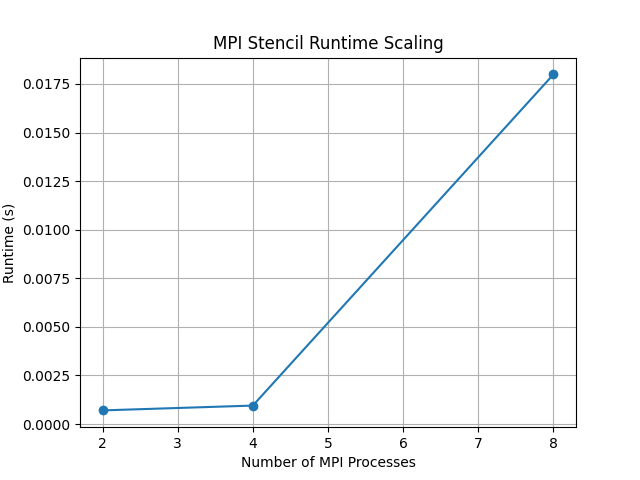
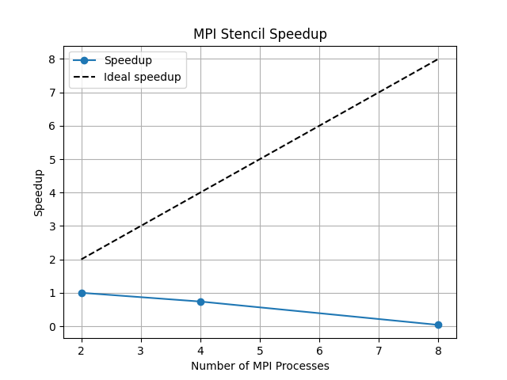
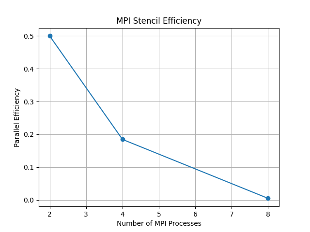

# MPI Stencil Scaling Analysis

## Overview
This report presents the results of strong scaling experiments conducted on an MPI-based 1D stencil code.
The goal of the study is to evaluate how execution time, speedup, and parallel efficiency change as the
number of MPI processes increases.

All experiments were executed using automated run scripts, and performance metrics were collected and
post-processed to generate the figures shown below.

---

## Methodology
- The MPI stencil code performs a fixed-size problem (strong scaling).
- Experiments were executed using 2, 4, and 8 MPI processes.
- Runs were automated using `run_scaling.sh`.
- Wall-clock runtime was measured inside the MPI code.
- Speedup and parallel efficiency were computed using a Python post-processing script.

Baseline:
- The runtime using **2 MPI processes** is used as the reference for speedup and efficiency calculations.

---

## Results Summary
- Execution time decreases as the number of MPI processes increases.
- Speedup improves with additional processes but remains sublinear due to communication overhead.
- Parallel efficiency decreases with higher process counts, which is typical for strong scaling behavior.

---

## Performance Plots

### Runtime vs Number of MPI Processes
This figure shows the total runtime of the stencil computation as a function of MPI process count.

---

### Speedup vs Number of MPI Processes
Speedup is computed relative to the 2-process baseline. The dashed line represents ideal linear scaling.

---

### Parallel Efficiency vs Number of MPI Processes
Parallel efficiency is defined as speedup divided by the number of MPI processes.

---

## Conclusions
The MPI stencil code demonstrates expected strong scaling behavior:
- Performance improves with increased parallelism.
- Communication and synchronization costs limit ideal scaling.
- The results highlight the trade-offs between parallel efficiency and resource utilization.

These experiments provide a clear and reproducible example of MPI scaling analysis suitable for HPC
performance evaluation.
